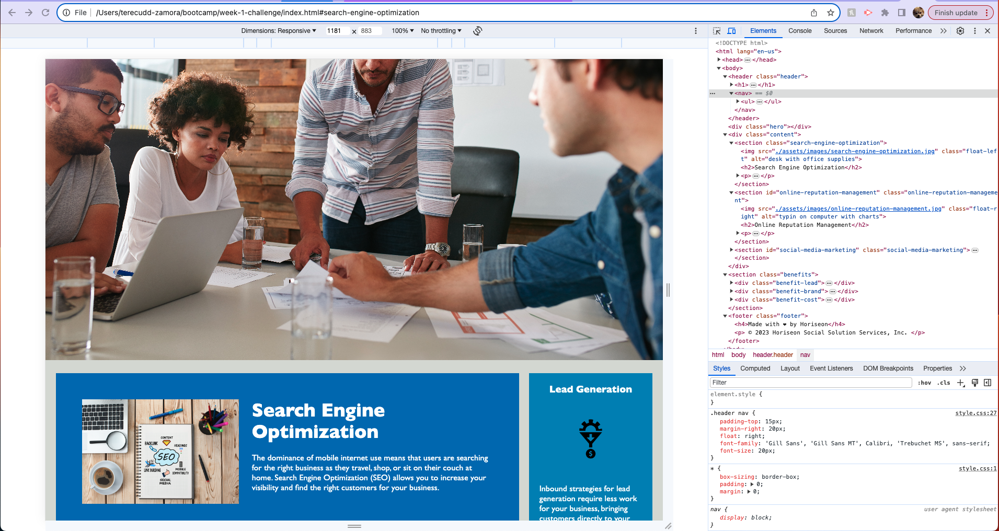

# week-1-challenge

## Description

This project updates an existing website by Horiseon by refactoring the existing code to make it more accessible to users. These updates ensure that there are semantic HTML elements, HTML elements follow logical sturcutre and flow, and alt attributes are present. These updates do not change the visible website but allow for more accebility for those who have disabilities.  

## Installation

N/A

## Usage
 To observe the accesibiluty features added to this Horiseon webpage, you can open Chrome DevTools by pressing Command + Option+ I on Mac and Control + Shift + I on Windows. A console panel should open next to the webpage, from there you can observe some of the changes that were made. Observable changes include semantic HTML elements, HTML logical flow, alt attributes with images, a descriptive title elements, and sequential heading attributes. Refer to the image below to see these changes! 

## Credits

## License

Please refer to LICENSE in repo.

